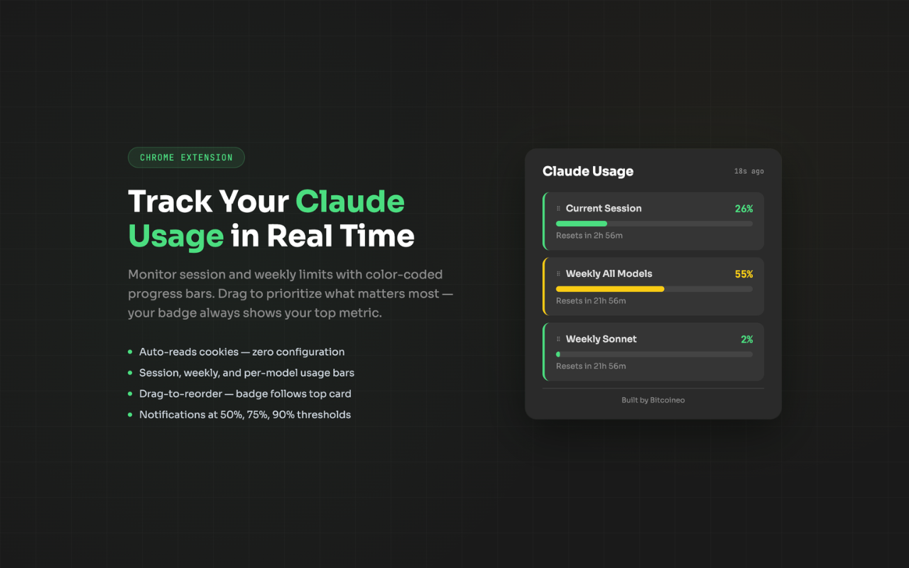

# Claude Usage Tracker

Chrome extension that shows your Claude.ai usage limits in real time. Reads your session cookies automatically, displays color-coded progress bars for each usage tier, and keeps a live badge on the toolbar icon.

**Stack:** `Chrome Extension MV3 · Vanilla JS · claude.ai API · chrome.cookies · chrome.alarms`

---

## Why I built this

Claude has usage limits but no built-in way to see how close you are until you hit them. I wanted a persistent indicator in my toolbar so I could manage my session and weekly quotas without getting blindsided mid-conversation.

## Features

- **Auto cookie reading** Reads claude.ai cookies directly via chrome.cookies API, zero setup required
- **Usage bars** Current Session (5h), Weekly All Models (7d), Weekly Sonnet, and more. Unavailable tiers are hidden automatically
- **Color-coded thresholds** Green (under 50%), Yellow (50-75%), Orange (75-90%), Red (over 90%) on bars, card bordernd badge
- **Live toolbar badge** Always shows the utilization of whichever card is in the first position
- **Drag-to-reorder** Drag cards by the grip handle to prioritize the metric you care about. Order persists via chrome.storage.local and updates the badge instantly
- **Threshold notifications** Desktop alerts at 50%, 75%, and 90%. Each fires once and resets when usage drops back below
- **Auto-refresh** Polls the usage API every 5 minutes via chrome.alarms with an "Updated Xs ago" indicator
- **Dark theme** Matches Claude's UI aesthetic

## Screenshots

## Install

### From Chrome Web Store

[Install Claude Usage Tracker](https://chromewebstore.google.com/detail/claude-usage-tracker/leehnhnjmhkcilhfciocoabjoeecioil)

### From Source

1. Clone this repo
2. Open chrome://extensions
3. Enable Developer mode (top right)
4. Click Load unpacked and select the project folder
5. Sign in to claude.ai in any tab
6. Click the extension icon to see your usage

## How It Works

1. background.js runs on a 5-minute alarm cycle
2. Reads all cookies from claude.ai via chrome.cookies.getAll()
3. Extracts the organization ID from the lastActiveOrg cookie
4. Calls https://claude.ai/api/organizations/{orgId}/usage with the cookie header
5. Stores the response in chrome.storage.local and updates the badge
6. popup.js reads from storage on open and renders progress bars dynamically

## Permissions

| Permission | Why |
|------------|-----|
| cookies | Read claude.ai cookies to authenticate API requests |
| alarms | Poll the usage endpoint every 5 minutes |
| storage | Persist usage data, card order, and notification flags |
| notifications | Desktop alerts at 50%, 75%, and 90% thresholds |
| host_permissions: claude.ai | Required for cookie access and API fetch |

## File Structure

    manifest.json        Manifest V3, permissions, service worker, popup
    background.js        Cookie reading, API polling, badge updates, notifications
    popup.html           Popup markup
    popup.css            Dark theme styles, progress bars, drag states
    popup.js             Dynamic rendering, drag-and-drop, time calculations
    icons/               Extension icons (16, 48, 128px)
    store/               Chrome Web Store assets and listing copy

## GitHub Topics

`chrome-extension` `claude` `anthropic` `usage-tracker` `manifest-v3` `javascript` `productivity` `ai-tools`
